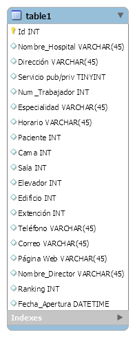

# Practica 02

## Estimación de tamaño de una base de datos con MySQL WorkBench

  1.	Definir variables constantes
        <table>
          <tr>
            <td>ID:Int</td>
            <td>4 Bytes</td>
          </tr>
          <tr>
            <td>Nombre_Hospitas:VERCHAR(45)</td>
            <td>32 Bytes</td>
          </tr>
            <tr>
            <td>Dirección:VERCHAR(45)</td>
            <td>32 Bytes</td>
          </tr>
            <tr>
            <td>Servicio_Pub/Priv:TINYINT</td>
            <td>1 Byte</td>
          </tr>
            <tr>
            <td>Num_Trabajador:INT</td>
            <td>4 Bytes</td>
          </tr>
           <tr>
            <td>Especialidad:VERCHAR(45)</td>
            <td>32 Bytes</td>
          </tr>
           <tr>
            <td>Horario:VERCHAR(45)</td>
            <td>32 Bytes</td>
          </tr>
          <tr>
            <td>Paciente:INT</td>
            <td>4 Bytes</td>
          </tr>
            <tr>
            <td>Cama:INT</td>
            <td>4 Bytes</td>
          </tr>
           <tr>
            <td>Sala:INT</td>
            <td>4 Bytes</td>
          </tr> <tr>
            <td>Elevador:INT</td>
            <td>4 Bytes</td>
          </tr>
            <tr>
            <td>Edificio:INT</td>
            <td>4 Bytes</td>
          </tr>
          <tr>
            <td>Extención:INT</td>
            <td>4 Bytes</td>
         </tr>
             <tr>
            <td>Teléfono:VERCHAR(45)</td>
            <td>32 Bytes</td>
         </tr>
  
            <tr>
            <td>Correo:VERCHAR(45)</td>
            <td>32 Bytes</td>
  </tr>
  <tr>
            <td>Página_Web:VERCHAR(45)</td>
            <td>32 Bytes</td>
         </tr> 
  <tr>
            <td>Nombre_Director:VERCHAR(45)</td>
            <td>32 Bytes</td>
         </tr>
        <tr>
            <td>Reanking:INT</td>
            <td>4 Bytes</td>
         </tr>
           <tr>
            <td>Fecha_Apertura:DATETIME</td>
            <td>3 Bytes</td>
         </tr>
    </table>
    
    
    
  2.	Encontrar número de páginas para todos los registros
  
  3.	Encontrar tamaño de una  fila 
  
  4.	Encontrar tamaño de una página (filas por filas de páginas)
  
  5.	Encontrar tamaño de la base de dato (número de páginas por número de páginas)

